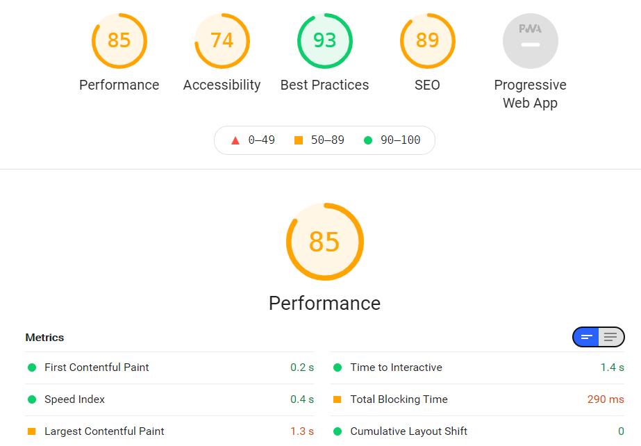

# 性能优化
我选择了 LightHouse 进行性能体检。
## 指标评分



- FCP (First Contentful Paint)

渲染第一个元素(文本、图片、canvas...)的时间点

- SI (Speed Index)

首屏展现时间

- LCP (Largest Contentful Paint)

渲染可视区域内最大内容元素的时间点

- TTI (Time to Interactive)

页面资源加载成功并能响应用户交互的时间点

- TBT (Total Blocking Time)

FCP到TTI之间,主线程被long task(超过50ms)阻塞的时间之和

- CLS (Cumulative Layout Shift)

累计布局偏移值

- FID (First Input Delay)

用户第一次在页面进行交互(点击链接、按钮、自定义js事件),到浏览器实际开始处理这个事件的时间
## 优化方案
方案就主要以性能指标作为维度，我根据改善建议，主要分为以下几个点:
### 渲染可视区域内最大内容元素的时间点
Largest Contentful Paint = 1.3 s

可以看到，渲染可视区域内最大内容元素的时间比较长，markdown-editor最大内容绘制元素是textarea中的文本元素。

原因: 准备文本 => 解析markdown文本 => 初始化textarea => 绘制。

这也难怪LCP指标的数据表现不理想了,

于是,我决定对最大内容绘制元素进行修改，从而提升LCP时间。替换最大内容，替换成 loading 元素。

### TBT (Total Blocking Time) / TTI (Time to Interactive)
Time to Interactive = 1.4 s

Total Blocking Time = 290 ms

#### 异步加载
我的处理方案就是对第三方包进行异步加载。这里需要注意的是script async/defer的区别,我使用的是defer进行异步加载(async加载完毕后会立即执行,阻塞主线程,影响DOM解析).
```js
<script
      defer
></script>
```

#### 优化构建bundle体积
查看基于webpack-bundle-analyzer生成的体积分析报告我发现有一个可优化的大产物:

- lodash

网站中只有用到防抖函数，可以改用手写防抖即可。

经过优化,bundle体积(gizp前)由原来的1.8MB减小至1.3MB.

### 缓存
从建议中可以看到，有两个静态资源可以缓存

- /js/chunk-vendors.js
- /js/app.js

HTTP 缓存可以加快重复访问时的页面加载时间。

可以采用配置服务器以返回 Cache-Control HTTP 响应标头：
```
Cache-Control: max-age=xxx
```

### `<html>` 元素没有[lang]属性
从建议中可以看到，`<html>` 元素没有[lang]属性

如果页面没有指定 lang 属性，屏幕读取器会假定该页面使用用户在设置屏幕读取器时选择的默认语言。如果页面实际上不是使用默认语言，那么屏幕阅读器可能无法正确宣布页面的文本。

名称和标签这些是改进应用程序中控件语义的机会。这可能会增强用户使用辅助技术(如屏幕阅读器)的体验。


### 表单元素没有相关联的标签
从建议中可以看到，表单元素没有相关联的标签

标签确保表单控件能够通过辅助技术(如屏幕阅读器)正确地显示出来。

我的解决方案就是加上标签

```html
    <textarea  name="text" autofocus="true"  :value="input" @input="update"></textarea>
```
### 没有使用HTTPS
所有的站点都应该使用HTTPS来保护，即使是那些不处理敏感数据的站点。这包括避免混合内容，即一些资源通过HTTP加载，尽管最初的请求是通过HTTPS服务的。HTTPS防止入侵者篡改或被动地监听你的应用程序和用户之间的通信。

我的方案是使用上 HTTPS

### 缺少大型第一方JavaScript的源映射

源映射将简化后的代码转换为原始源代码。这有助于开发人员在生产环境中进行调试。此外，灯塔还能提供更深入的见解。考虑部署源映射来利用这些优势。

### 文档没有元描述
元描述可以包含在搜索结果中，以简洁地总结页面内容。

### PWA优化
可以考虑将 markdown-editor 支持 PWA

- 注册一个控制页面和 start_url 的service worker
- 重定向HTTP 到 HTTPS
- 为自定义启动画面配置。
- 为地址栏设置主题颜色
```
 <meta name="theme-color">
```
- 视口的内容大小正确
有
```
<meta name="viewport">
```
标签宽度或初始缩放
- 提供一个有效的苹果触摸图标
Manifest没有一个可屏蔽的iconNo

### 避免持久化 Store 数据
在 markdown-editor 中我后来加入了 Storage。

我们应该尽量减少直接写入 Storage 的频率：

- 多次写入操作合并为一次，比如采用函数节流或者将数据先缓存在内存中，最后在一并写入
- 只有在必要的时候才写入，比如只有关心的模块的数据发生变化的时候才写入

### 避免持久化存储的容量持续增长
由于持久化缓存的容量有限，比如 localstorage 的缓存在某些浏览器只有 5M，我们不能无限制的将所有数据都存起来，这样很容易达到容量限制，同时数据过大时，读取和写入操作会增加一些性能开销，同时内存也会上涨。

尤其是将 API 数据进行 normalize 数据扁平化后之后，会将一份数据散落在不同的实体上，下次请求到新的数据也会散落在其他不同的实体上，这样会带来持续的存储增长。

因此，当设计了一套持久化的数据缓存策略的时候，同时应该设计旧数据的缓存清除策略，例如请求到新数据的时候将旧的实体逐个进行清除。
### 其他
除了上面的优化外，markdow-editor功能复杂了后，还可以优化：

1. 减少 HTTP 请求
2. 使用 HTTP2
解析速度快
多路复用
首部压缩
优先级
流量控制
服务器推送
3. 使用服务端渲染
客户端渲染过程
服务端渲染过程
4. 静态资源使用 CDN
CDN 原理
5. 将 CSS 放在文件头部，JavaScript 文件放在底部
6. 使用字体图标 iconfont 代替图片图标
压缩字体文件
7. 善用缓存，不重复加载相同的资源
8. 压缩文件
9. 图片优化

(1). 图片延迟加载

(2). 响应式图片

(3). 调整图片大小

(4). 降低图片质量

(5). 尽可能利用 CSS3 效果代替图片

(6). 使用 webp 格式的图片

10. 通过 webpack 按需加载代码，提取第三库代码，减少 ES6 转为 ES5 的冗余代码
11. 减少重绘重排
12. 使用事件委托
13. if-else 对比 switch
14. 查找表
15. 避免页面卡顿
16. 使用 requestAnimationFrame 来实现视觉变化
17. 使用 Web Workers
18. 使用位操作
19. 不要覆盖原生方法
20. 降低 CSS 选择器的复杂性
21. 使用 flexbox 而不是较早的布局模型
22. 使用 transform 和 opacity 属性更改来实现动画
23. 合理使用规则，避免过度优化